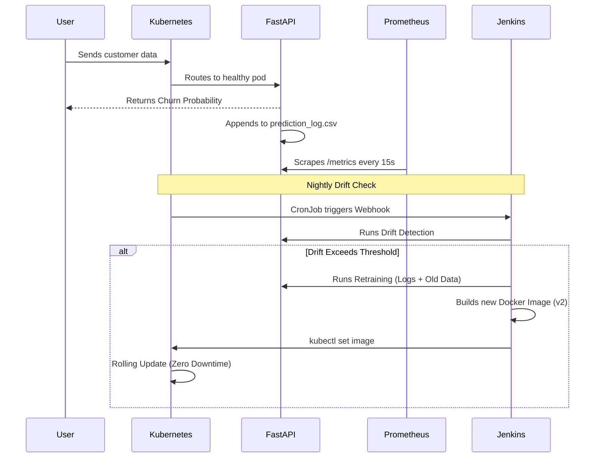

# Self-Healing MLOps System 🚀

A production-ready, fully autonomous Machine Learning Operations (MLOps) platform. This project demonstrates a complete end-to-end pipeline that not only serves machine learning predictions but also monitors itself, detects data drift, alerts engineers, and automatically retrains and redeploys its models with zero downtime.

## 🌟 Key Features
- **FastAPI Inference Engine**: High-performance API serving a scikit-learn Random Forest model.
- **Continuous Logging**: Every prediction is thread-safely logged for future analysis.
- **Proactive Drift Detection**: Statistical analysis (Normalized Mean Difference & Total Variation Distance) comparing live production data against training baselines.
- **Autonomous Retraining**: Hot-swapping model artifacts in-memory without server restarts.
- **Dockerized Architecture**: Fully reproducible environments.
- **Kubernetes Orchestration**: Self-healing pods, LoadBalancer networking, and CronJobs.
- **Jenkins CI/CD**: Automated pipelines for pulling code, testing drift, rebuilding images, and rolling out deployments.
- **Prometheus & Grafana Observability**: Live dashboards tracking API requests, latency, and error rates, with AlertManager routing.

---

## 🏗️ High-Level Architecture

```mermaid
flowchart TD
    User([End User]) -->|POST /predict| K8sService[K8s LoadBalancer]
    K8sService --> API[FastAPI Inference Pods]
    
    subgraph K8s Cluster
        API -->|Logs features/labels| Logs[(Prediction CSV Logs)]
        API -.->|Exposes /metrics| Prom[Prometheus]
        Prom -.->|Visualizes| Grafana[Grafana Dashboard]
        Prom -.->|Triggers| Alert[AlertManager (Slack/Email)]
        
        Cron[K8s CronJob] -->|Nightly Check| JenkinsWebhook[Jenkins Webhook]
    end
    
    subgraph CI/CD Pipeline
        JenkinsWebhook --> Jenkins[Jenkins CI/CD]
        Jenkins -->|1. Pull Code| GitHub[GitHub Repo]
        Jenkins -->|2. Check Drift| DriftModule{Drift Detected?}
        
        DriftModule -->|Yes| Retrain[Auto-Retrain Model]
        Retrain -->|Generate v2| BuildImage[Docker Build]
        BuildImage --> Push[Push to Registry]
        Push --> Deploy[Kubectl Rolling Update]
        Deploy --> API
        
        DriftModule -->|No| Exit[Stop Pipeline]
    end
```

---

## 🧩 Detailed Component Flow



---

## 🚀 Getting Started

### Prerequisites
- Docker & Docker Desktop (or Minikube)
- Kubernetes enabled locally
- Python 3.10+
- Jenkins (local or containerized)

### 1. Local Development Setup
```bash
# Clone the repository
git clone https://github.com/yourusername/self-healing-mlops.git
cd self-healing-mlops

# Install dependencies
python -m venv venv
source venv/bin/activate  # On Windows: venv\Scripts\activate
pip install -r requirements.txt

# Run the API locally
uvicorn app.main:app --reload --port 8000
```

### 2. Docker Setup
```bash
# Build the image
docker build -t churn-prediction-api:latest .

# Run the container
docker run -p 8000:8000 churn-prediction-api:latest
```

### 3. Kubernetes Deployment
Navigate to the `k8s/` directory and apply the manifests:
```bash
# Deploy API and Service
kubectl apply -f k8s/deployment.yaml
kubectl apply -f k8s/service.yaml

# Deploy Monitoring Stack
kubectl apply -f k8s/prometheus.yaml
kubectl apply -f k8s/prometheus-rules.yaml
kubectl apply -f k8s/alertmanager.yaml
kubectl apply -f k8s/grafana.yaml

# Deploy Automation
kubectl apply -f k8s/cronjob.yaml
```

---

## 📊 Monitoring Setup

1. Wait for pods to spin up: `kubectl get pods`
2. Access **Grafana** at `http://localhost:3000` (Login: `admin` / `mlops_admin`).
3. Add **Prometheus** as a data source using URL `http://prometheus-service:9090`.
4. Import standard FastAPI dashboards or create your own using PromQL queries like `sum(http_requests_total)`.

---

## 📸 Screenshots
*(Add screenshots of your system here before uploading to GitHub)*
- `[Screenshot: FastAPI Swagger UI]`
- `[Screenshot: Grafana Dashboard showing traffic]`
- `[Screenshot: Jenkins Pipeline Success Stage]`

---

## 🔮 Future Improvements
- Migrate local CSV logging to a highly available database (e.g., PostgreSQL or MongoDB).
- Integrate MLflow or Weights & Biases for advanced model registry and artifact tracking.
- Deploy to AWS EKS or GCP GKE using Terraform (Infrastructure as Code).
